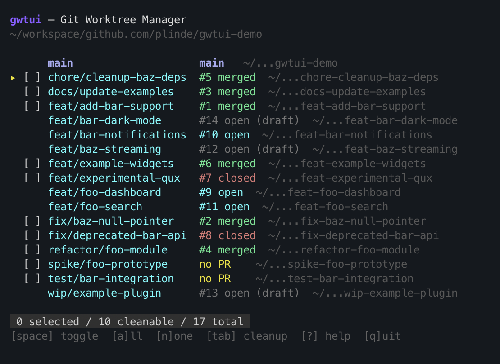

# gwtui

Interactive TUI for managing git worktrees with GitHub PR status enrichment.



## Features

- Lists all git worktrees with color-coded PR status (open / draft / merged / closed / no PR)
- Interactive selection of worktrees to clean up
- Protects main worktree and active/draft PRs from accidental deletion
- Batch removal of worktrees and associated branches
- Scrollable list with vim-style keybindings

## Requirements

- Go 1.25+
- [`gh`](https://cli.github.com/) CLI (authenticated)
- git

## Install

```bash
go install github.com/plinde/gwtui/cmd@latest
```

Or clone and build locally:

```bash
make install   # builds and copies to ~/bin/gwtui
```

## Usage

```bash
gwtui                     # auto-detect repo from current directory
gwtui /path/to/repo       # positional argument
gwtui --repo /path/to/repo
```

## Keybindings

### Navigation

| Key | Action |
|-----|--------|
| `↑` / `k` | Move cursor up |
| `↓` / `j` | Move cursor down |

### Selection

| Key | Action |
|-----|--------|
| `space` | Toggle selection (cleanable rows only) |
| `a` | Select all cleanable worktrees |
| `n` | Deselect all |

### Actions

| Key | Action |
|-----|--------|
| `tab` | Proceed to cleanup confirmation |
| `enter` | Confirm cleanup / quit |
| `backspace` | Go back |
| `?` | Show help |
| `q` / `ctrl+c` | Quit |

## PR State Legend

| State | Color | Cleanable | Description |
|-------|-------|-----------|-------------|
| `open` | Cyan | No | PR is open — protected |
| `draft` | Gray | No | PR is draft — protected |
| `merged` | Green | Yes | PR merged — safe to clean |
| `closed` | Red | Yes | PR closed — safe to clean |
| `no PR` | Yellow | Yes | No associated PR — review before cleaning |
| `main` | Blue (bold) | No | Main worktree — always protected |

## License

[MIT](LICENSE)
