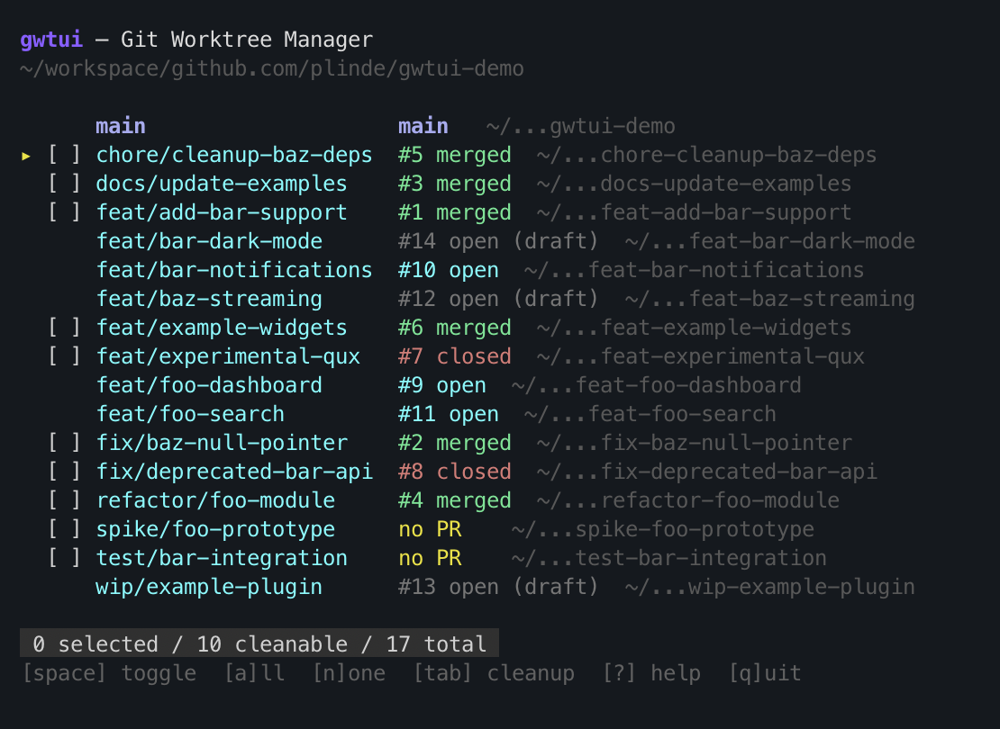

# gwtui

Interactive TUI for managing git worktrees with GitHub PR status enrichment.



## Features

- Lists all git worktrees with color-coded PR status (open / draft / merged / closed / no PR)
- Interactive selection of worktrees to clean up
- Protects main worktree and active/draft PRs from accidental deletion
- Batch removal of worktrees and associated branches
- Scrollable list with vim-style keybindings
- Org-wide view across direct sibling repo checkouts

## Requirements

- Go 1.25+
- [`gh`](https://cli.github.com/) CLI (authenticated)
- git

## Install

```bash
go install github.com/plinde/gwtui/cmd@latest
```

Or clone and build locally:

```bash
make install   # builds and copies to ~/.local/bin/gwtui
```

## Usage

```bash
gwtui                                  # infer org root and optional repo scope from cwd
gwtui /path/to/repo                    # positional repository/org-root path
gwtui --repo /path/to/repo             # legacy explicit target path
gwtui --repo /path/to/org              # legacy explicit org-root path
gwtui --org Opportunistiq              # explicit org, all local checkouts
gwtui --org Opportunistiq --repo infra # explicit org with stable repo scope
gwtui --org /path/to/org --repo infra  # explicit org-root path with repo scope
```

Explicit positional paths cannot be combined with `--org` or `--repo`. With
`--org`, `--repo` is a repository name used as the stable launch scope. Without
`--org`, `--repo` keeps its original path meaning.

### Org Roots

An org root is a directory whose immediate children are local GitHub repository
checkouts:

```text
~/workspace/github.com/example-org/
├── api/
├── infrastructure/
└── web/
```

Running `gwtui` from that directory shows one combined list of worktrees for the
direct checkouts under the org root. Running from inside one of its repositories
loads the org data but keeps the TUI scoped to that repository. The repository
path and a distinct `scope: repo:<repository>` indicator are shown; clearing a
user filter never reveals sibling repositories. The org root and repository are
inferred from the conventional `github.com/<org>/<repo>` path, including linked
worktrees. To see the org-wide list, launch from the org root or use `--org`.

gwtui is filesystem-driven: it only knows about repositories that are checked
out as child directories, and it does not query GitHub for repositories that
are not present locally.

Linked worktree directories beside the main checkout are skipped during org-root
discovery, since they are already associated with their owning repository by
`git worktree list`. In org-wide mode, branch labels are shown as
`repo:branch`, and cleanup runs against each selected row's owning checkout.

## Keybindings

### Navigation

| Key | Action |
|-----|--------|
| `↑` / `k` | Move cursor up |
| `↓` / `j` | Move cursor down |
| `home` / `g` | Jump to the first row |
| `end` / `G` | Jump to the last row |
| `pgup` / `ctrl+b` | Move up one visible page |
| `pgdown` / `ctrl+f` | Move down one visible page |

### Selection

| Key | Action |
|-----|--------|
| `space` | Toggle selection (cleanable rows only) |
| `ctrl+a` | Toggle all visible merged/closed worktrees; other selections are preserved |
| `a` | Select all cleanable worktrees |
| `n` | Deselect all |

### Actions

| Key | Action |
|-----|--------|
| `tab` | Proceed to cleanup confirmation |
| `enter` | Jump to the highlighted worktree |
| `r` | Refresh worktrees and PR status |
| `<` / `>` | Change sort column |
| `s` | Reverse sort direction |
| `/` | Edit filter |
| `esc` | Clear a user filter; keep repository launch scope |
| `backspace` | Go back |
| `?` | Show help |
| `q` / `ctrl+c` | Quit |

The cursor row uses a full-width horizontal highlight while preserving each
column's status color.

Every cleanup has the normal review confirmation. If the selected set contains
a worktree whose current PR is open (including a draft), gwtui shows a second,
explicit open-PR warning and requires Enter again before removal.

### Filtering

Press `/` to open the filter editor. Typing does not change the list until you
press `enter` or `tab`; applying returns control to the normal list, so arrows,
selection, jump, sorting, refresh, and cleanup work on the filtered rows. Press
`/` again to edit the active query, or `esc` to clear it. When launched inside a
repository, filtering is applied within that stable repository scope; `esc`
never expands the list to sibling repositories.

Whitespace-separated operands are ANDed. Bare operands preserve the original
case-insensitive substring search across branch label, repository, path, status,
and PR fields. Repository-scoped operands match only the owning repository:

```text
repo:infrastructure          # repository name contains "infrastructure"
repo:infra merged            # infrastructure rows whose state/PR fields match "merged"
-repo:archive                # exclude repository names containing "archive"
```

`repo:` with no value is ignored. An unknown prefix such as `topic:one` remains
a normal bare substring search for compatibility. Filter input supports
left/right, home/end, insertion at the cursor, backspace, and delete.

## PR State Legend

| State | Color | Cleanable | Description |
|-------|-------|-----------|-------------|
| `open` | Cyan | No | PR is open — protected |
| `draft` | Gray | No | PR is draft — protected |
| `merged` | Green | Yes | PR merged — safe to clean |
| `closed` | Red | Yes | PR closed — safe to clean |
| `no PR` | Yellow | No | No associated PR — protected, clean manually |
| `main` | Blue (bold) | No | Main worktree — always protected |

## License

[MIT](LICENSE)
